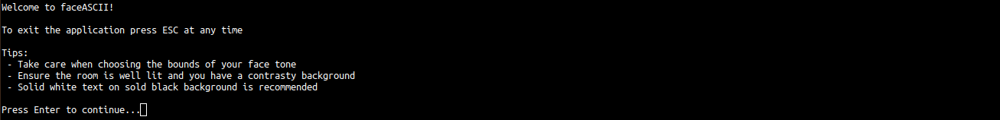
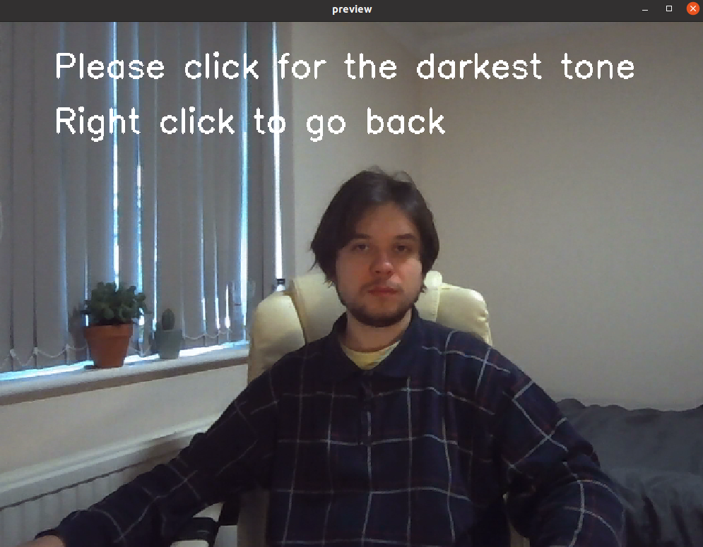
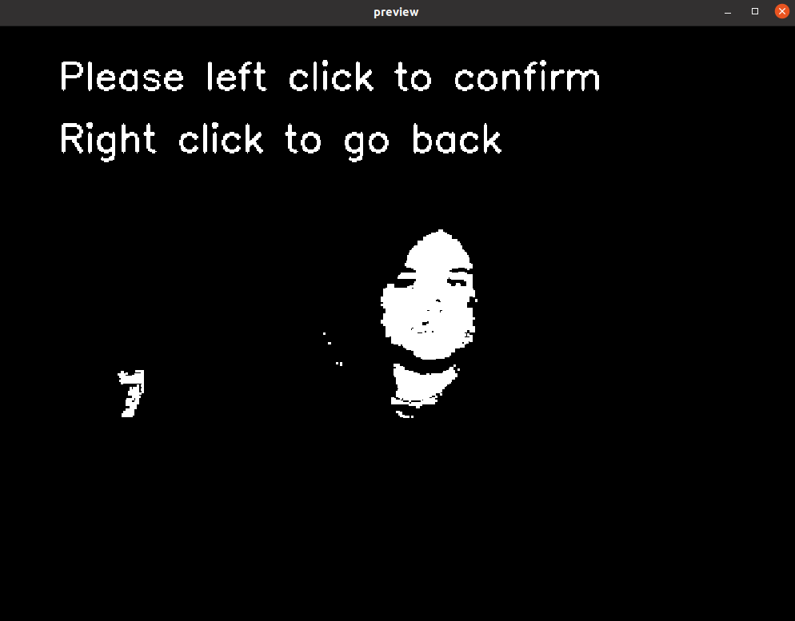
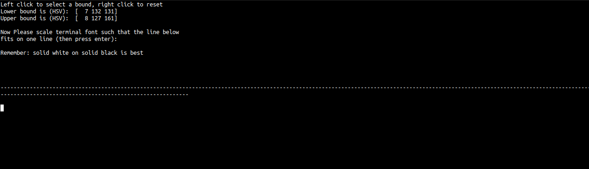

# Critical Studies week 12

Week 12 homework for the CCI Critical Studies: Computational Thinking and Critical Practice course

Designing a method - step one, document the steps of your own process This week, you are invited to create a work of art. I can be anything, a digital collage, a sculpture, a piece of creative code.  

## Terminal Face
These piece uses your webcam to parse your face into ASCII in real time.
- Ensure you have `numpy` and `cv2`
	- NB these can be installed with:
	-  `pip install opencv-python`
	-  `pip install numpy`
- run with `python face_ascii.py`

\
The UI: (NB: This was after iterating on some of Daan's advice)

**What are the values you are considering?**
\
The main value I aimed to consider with this is the debate surrounding computer vision and racism. I also wanted the piece to take place in the terminal as I believe the ASCII aesthetic would be less effective if it were rendered as text on a seperate window. I hoped this would make a regular terminal window seem more alive.

**Do they take in to accounts the critiques of this week's reading? Write them down.**
\
"Design thinking is a rebrand for white supremacy: What is universal? What templates as neutral? What are our defaults?" - What should my default skin mask be for the application? Is it even fair to set one? I believe that my software could in no way be a neutral tool or in fact just not plain racist if I used a default skin tone. For that reason I made considerable effort to ensure my software was as neutral as possible.

**Are you using skills from any methods you have see in the past? (User Experience Design, Iterative Design Processes, Design Thinking, etc)**
\
I am using some methods from User Experience Design. Particularly addressing the gulf of execution mentioned in Don Norman's "The design of everyday things" to try and make the controls seem as natural as possible (this was very hard for me!!). I attempted to ensure the signifiers were obvious for the affordances of both the terminal and the webcam window.

**What are the questions you are asking yourself? Make a short list.**
- Is the user journey from start to finish intuitive?
- Are the controls obvious?
- Am I being careful to accommodate all face types?
- Am I being careful in my use of language to not be offensive?
- Is going from the terminal to the webcam and back too much?

**How are you valuing if the work is complete? What are the metrics you are using to do this? Make another list.**
- Probably a peer review process
- It has been tested numerous times and feedback has been taken on board
- When I feel proud of my work
\
I feel the work is nowhere near complete, the closer I get to completion the more I realise needs to be done. This highlights a key point of my method, starting with a loose idea and through the journey of creating I will often find myself finishing with a much more complex product.

**Show this work to someone else in the class. How do you record their reaction? Is it a questionnaire? An open ended discussion? Now take this reaction and think of it as data.**
\
Daan and I had an open ended discussion culiminating in a formal response. This can be seen [here](https://www.notion.so/daaan/Review-faceASCII-25cc28708cfb4c97af9350c82469c8e2).

**What tools could you use to analyze it? Maybe you look at at common emotionally charged words and group them together? Maybe you ask them to fill out a questionnaire? Now review the results of this data.**
\
I poked through the formal response to get the key points made both about the design, and the piece itself. These were:
- Have clearer and more concise instructions at the start
- More feedback would be good in the tone setup stages, thinking more deeply at Norman's gulf of execution and evaluation
- Make the work more transparant of how the skin colour domain relates to the signal processing
- Explore more deeply the ethics of de-racing the user (should the user embrace their skin colour instead of being labelled in the same domain as everyone else)

**How do you respond it? Do you re-visit and iterate your work? Do you look for bias in the data? What are the ways to think about it? Make a note of this.**
\
Daan's feedback definitley necessitates a new iteration for my work. There were clearly some big UI design flaws as well as some poorly chosen wording in the piece. A new iteration was always expect though, as very rarely I would trust wholly positive feedback on the first generation. As extremely helpful Daan's feedback was however, I also need the feedback from other people; particularly people from different social backgrounds. I think this is especically important when tackling as important and deep-rooted subjects as racism.
